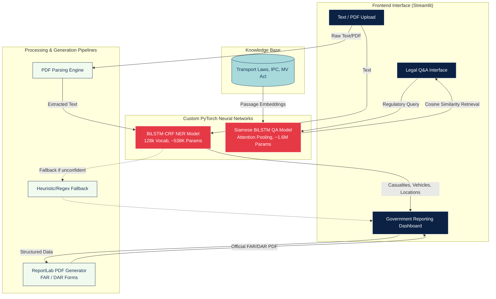

# Transport SLM 

An AI-powered incident reporting and legal assistance platform developed for the **Ministry of Road Transport and Highways (MoRTH)**. This tool automates the extraction of accident details from unstructured text (such as news reports and FIRs) and streamlines the generation of official FAR/DAR reports for the Claims Tribunal.

---

## Architecture




## Key Features

- **Automated Data Extraction**: Extracts critical entities (victims, vehicle registration numbers, collision types, IPC sections) from raw unstructured text.
- **Custom Deep Learning Models**: Engineered two neural networks from scratch rather than relying on external APIs:
  1. **Named Entity Recognition (NER)**: A BiLSTM-CRF architecture trained on transportation domain sequences.
  2. **Semantic QA Retriever**: A Siamese BiLSTM network with self-attention for precise retrieval of legal transport regulations.
- **Official Form Generation**: Instantly maps extracted data into fully formatted, ready-to-submit PDF reports (First Accident Report - Form 1 & Detailed Accident Report - Form VII).
- **Interactive Dashboard**: Professional, government-styled UI built with Streamlit for investigating officers and RTO staff.

## Tech Stack

- **Deep Learning**: PyTorch, NumPy
- **Frontend**: Streamlit, Custom CSS
- **Data Processing**: Pandas, Regular Expressions (Regex)
- **Document Handling**: ReportLab (PDF generation), pdfplumber (PDF extraction)

## Setup guide

1. **Clone the repository**
   ```bash
   git clone <your-repo-url>
   cd transport-slm
   ```

2. **Install dependencies**
   ```bash
   pip install -r requirements.txt
   ```

3. **Run the application**
   ```bash
   streamlit run pytorch_app.py
   ```


## Repository Structure

- `pytorch_app.py` - Main Streamlit application and UI logic.
- `pytorch_ner.py` - Architecture and training loop for the BiLSTM-CRF NER model.
- `pytorch_qa.py` - Architecture and training loop for the Siamese BiLSTM QA model.
- `pdf_generator.py` - Logic to dynamically generate formatted FAR and DAR PDF reports using ReportLab.
- `pdf_processor.py` - Utilities for parsing and cleaning uploaded PDF documents.
- `requirements.txt` - Python dependencies, optimized for deployment.
- `models/` - Pre-trained model weights (`.pt`) and vocabularies (`.pkl`).

---
*Developed for the Ministry of Road Transport & Highways (MoRTH) accident reporting workflow.*


## Models

| Model | Architecture | Parameters |
|-------|-------------|-----------|
| NER | BiLSTM-CRF | ~2.5M |
| QA | BiLSTM + Attention (Dual Encoder) | ~1.65M |


